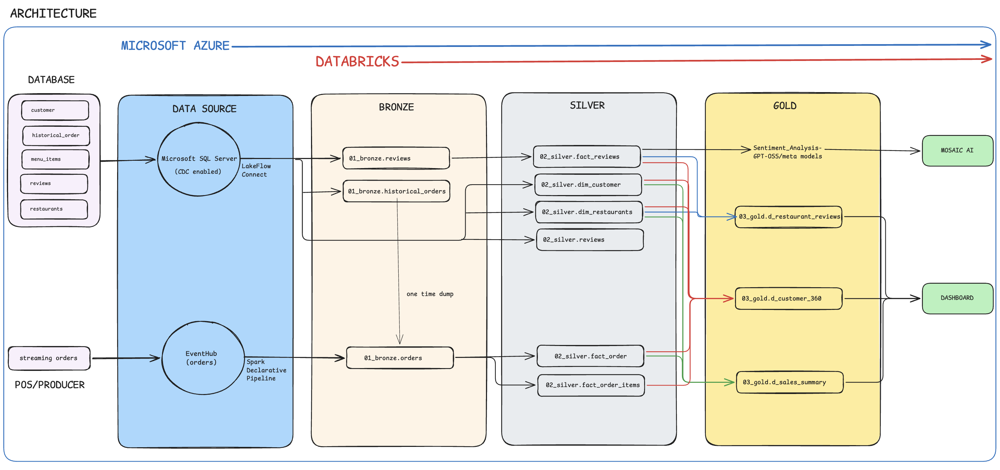
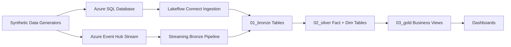

# Restaurant Chain Insights on Databricks

End-to-end data engineering and analytics project for a restaurant chain, built on Databricks with synthetic data generation, streaming ingestion, medallion transformations, and BI-ready gold models.



## Project Goals

- Generate realistic restaurant operational data (master, transactional, and review data).
- Ingest data into Databricks from multiple sources (SQL + Event Hub).
- Build a medallion architecture pipeline (bronze, silver, gold).
- Enrich customer reviews with LLM-powered sentiment and issue extraction.
- Deliver dashboard-ready gold tables for business users.

## High-Level Architecture



## Repository Structure

- [00_synthetic_data](00_synthetic_data): Python scripts to generate and stream synthetic data.
- [00_synthetic_data/sql](00_synthetic_data/sql): SQL setup scripts for source systems and schema docs.
- [01_pipelines](01_pipelines): Databricks declarative/streaming pipelines.
- [01_pipelines/pipeline_bronze_to_gold/silver](01_pipelines/pipeline_bronze_to_gold/silver): Silver fact transformations.
- [01_pipelines/pipeline_bronze_to_gold/gold](01_pipelines/pipeline_bronze_to_gold/gold): Gold business models.
- [diagrams](diagrams): Project diagrams.
- [dashboard_metrics.md](dashboard_metrics.md): KPI definitions for dashboards.
- [commands_used.md](commands_used.md): Operational and ad-hoc commands.

## Data Sources

### 1) Master Data (batch)

Generated by:
- [00_synthetic_data/00_sql_db.py](00_synthetic_data/00_sql_db.py)

Entities:
- Restaurants
- Menu items
- Customers

Output CSV files:
- [00_synthetic_data/data/restaurants.csv](00_synthetic_data/data/restaurants.csv)
- [00_synthetic_data/data/menu_items.csv](00_synthetic_data/data/menu_items.csv)
- [00_synthetic_data/data/customers.csv](00_synthetic_data/data/customers.csv)

### 2) Historical Orders (batch)

Generated by:
- [00_synthetic_data/01_historical_orders.py](00_synthetic_data/01_historical_orders.py)

Behavior:
- Generates 8,000 historical orders across ~6 months by default.
- Includes JSON-encoded line-item arrays in `items`.

Output CSV:
- [00_synthetic_data/data/historical_orders.csv](00_synthetic_data/data/historical_orders.csv)

### 3) Customer Reviews (batch)

Generated by:
- [00_synthetic_data/02_reviews.py](00_synthetic_data/02_reviews.py)

Behavior:
- Derives reviews from historical orders.
- Generates review text using rating-weighted templates.

Output CSV:
- [00_synthetic_data/data/customer_reviews.csv](00_synthetic_data/data/customer_reviews.csv)

### 4) Live Order Stream (near real-time)

Generated by:
- [00_synthetic_data/04_eventhub_orders.py](00_synthetic_data/04_eventhub_orders.py)

Behavior:
- Publishes random order events to Azure Event Hub.
- Uses `.env` variables: `EVENTHUB_CONNECTION_STRING`, `EVENTHUB_NAME`.

## Pipeline Layers

### Bronze Layer

- Streaming orders from Event Hub are ingested in:
	- [01_pipelines/pipeline_ingest_eventhub.py](01_pipelines/pipeline_ingest_eventhub.py)
- Table created: `orders` (bronze quality).
- Master/reference entities and batch transactional sources are expected to land in bronze via Lakeflow Connect ingestion from SQL Server/Azure SQL.

### Silver Layer

Core transformations:

- `fact_orders`
	- [01_pipelines/pipeline_bronze_to_gold/silver/fact_orders.py](01_pipelines/pipeline_bronze_to_gold/silver/fact_orders.py)
	- Adds order date/time derived attributes and data quality checks.

- `fact_order_items`
	- [01_pipelines/pipeline_bronze_to_gold/silver/fact_order_items.py](01_pipelines/pipeline_bronze_to_gold/silver/fact_order_items.py)
	- Parses and explodes nested items array into item-level facts.

- `fact_reviews`
	- [01_pipelines/pipeline_bronze_to_gold/silver/fact_reviews.sql](01_pipelines/pipeline_bronze_to_gold/silver/fact_reviews.sql)
	- Applies `ai_query` for sentiment + issue categorization.
	- Enforces expectations for valid sentiment/rating.

Reference schema docs:
- [00_synthetic_data/sql/silver_schemas.md](00_synthetic_data/sql/silver_schemas.md)

### Gold Layer

Business-facing models:

- `d_customer_360`
	- [01_pipelines/pipeline_bronze_to_gold/gold/d_customer_360.py](01_pipelines/pipeline_bronze_to_gold/gold/d_customer_360.py)
	- Customer spend, order behavior, favorite entities, loyalty tier, VIP flag.

- `d_restaurant_reviews`
	- [01_pipelines/pipeline_bronze_to_gold/gold/d_restaurant_reviews.py](01_pipelines/pipeline_bronze_to_gold/gold/d_restaurant_reviews.py)
	- Restaurant-level rating/sentiment distributions.

- `d_sales_summary`
	- [01_pipelines/pipeline_bronze_to_gold/gold/d_sales_summary.py](01_pipelines/pipeline_bronze_to_gold/gold/d_sales_summary.py)
	- Daily sales, AOV, customer counts, and order-type mix.

Reference schema docs:
- [00_synthetic_data/sql/gold_schemas.md](00_synthetic_data/sql/gold_schemas.md)

## Environment and Prerequisites

### Local (data generator)

- Python 3.10+
- Install dependencies:

```bash
pip install -r requirements.txt
pip install -r projects/databricks-e2e-project/00_synthetic_data/requirements.txt
```

Key dependency files:
- [../../requirements.txt](../../requirements.txt)
- [00_synthetic_data/requirements.txt](00_synthetic_data/requirements.txt)

Create `.env` at repo root with Event Hub values:

```env
EVENTHUB_CONNECTION_STRING=<your_eventhub_connection_string>
EVENTHUB_NAME=<your_eventhub_name>
```

### Cloud/Databricks

- Databricks workspace with Unity Catalog enabled.
- Access to Lakeflow Connect (for SQL ingestion).
- Azure SQL Database / SQL Server source configured.
- Azure Event Hub namespace + topic/hub.
- Model endpoint permission for `ai_query` used in review analysis.

## Setup and Run Order

### Step 1: Generate synthetic batch data

Use orchestrator script:
- [00_synthetic_data/03_run.py](00_synthetic_data/03_run.py)

```bash
cd projects/databricks-e2e-project/00_synthetic_data
python 03_run.py
```

This generates:
- Restaurants, menu, customers
- Historical orders
- Reviews

### Step 2: Prepare SQL source and CDC/CT

Use SQL setup script:
- [00_synthetic_data/sql/azuresqldatabase_setup.sql](00_synthetic_data/sql/azuresqldatabase_setup.sql)

Utility objects script:
- [00_synthetic_data/sql/utility_script.sql](00_synthetic_data/sql/utility_script.sql)

Then run Lakeflow utility procedures shown in setup SQL to fix permissions and enable change capture.

### Step 3: Start live event streaming

```bash
cd projects/databricks-e2e-project/00_synthetic_data
python 04_eventhub_orders.py
```

### Step 4: Run Databricks pipelines

1. Run ingestion pipeline to populate bronze tables.
2. Run bronze-to-silver and silver-to-gold transformations from:
	- [01_pipelines](01_pipelines)
3. Validate row counts and data quality expectations.

### Step 5: Build dashboards from gold

Use gold tables for BI artifacts and metrics documented in:
- [dashboard_metrics.md](dashboard_metrics.md)

## Dashboard Outputs

### Restaurant Chain Performance

- Total Orders
- Total Revenue
- Active Customers
- AOV
- Daily Sales Trend
- Best Selling Items
- Peak Hour Heatmap
- Revenue by Order Type / Category

### Review Insights

- Review Volume Trend
- Average Rating
- Sentiment Split (positive/neutral/negative)
- Issue categories: delivery, food quality, pricing, portion size
- Recent review feed

## Data Quality and Governance

- Silver transformations use `expect_all_or_drop` constraints to enforce validity.
- Review sentiment table enforces expectation checks in SQL.
- Gold tables are modeled as materialized views for consumption and performance.

## Useful Operational References

- Ad-hoc commands: [commands_used.md](commands_used.md)
- Architecture images:
	- [diagrams/Restaurant Chain Architecture.png](diagrams/Restaurant Chain Architecture.png)
	- [diagrams/synthetic_data.png](diagrams/synthetic_data.png)

## Known Caveats

- Catalog/schema names are environment-specific and should be parameterized per workspace.
- `fact_reviews.sql` references a concrete bronze table path; update catalog/schema names for your deployment.
- Ensure model permissions and quotas for `ai_query` to avoid review enrichment failures.

## Security Notes

- Never commit secrets (tokens, passwords, connection strings) to git-tracked files.
- Keep sensitive values in environment variables or secret scopes.

## License and Usage

This project is intended for educational and portfolio demonstration purposes. Adjust cloud resources, naming, and security controls before production use.